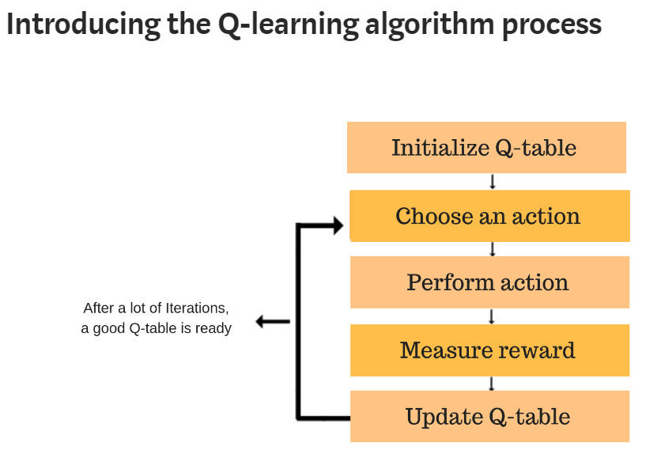
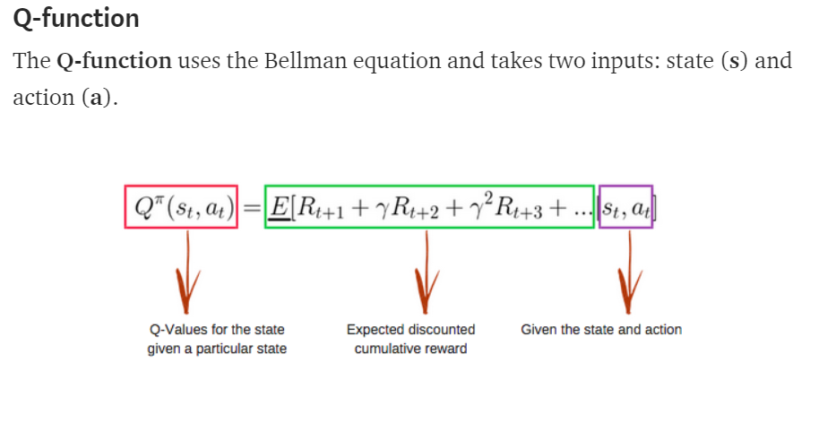
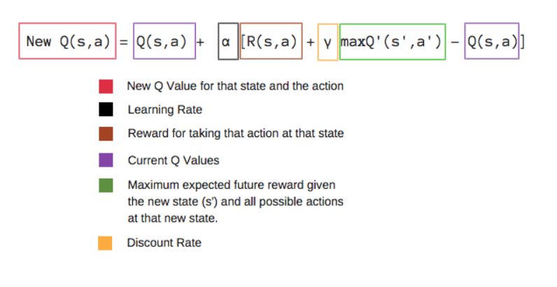

# Q-Learning Process

- Breaking it down into steps, we get

1. Initialize the Q-table by all zeros.
2. Start exploring actions: For each state, select any one among all
   possible actions for the current state (S).
3. Travel to the next state (S') as a result of that action (a).
4. For all possible actions from the state (S')
   select the one with the highest Q-value.
5. Update Q-table values using the equation.
6. Set the next state as the current state.
7. If goal state is reached, then end and repeat the process.

How we Update the q-table?
 
Simply by using Q-function

- Q-table: just a fancy name for a simple lookup table where we calculate
  the maximum expected future rewards for action at each state.
  Basically, this table will guide us to the best action at each state.

- Alpha (α): (the learning rate) should decrease as you continue to gain a
  larger and larger knowledge base.

- Gamma (γ): as you get closer and closer to the deadline, your preference
  for near-term reward should increase, as you won't be around long enough
  to get the long-term reward, which means your gamma should decrease.

- Epsilon (ϵ): as we develop our strategy, we have less need of exploration &
  more exploitation to get more utility from our policy,
  so as trials increase, epsilon should decrease.

- We decide whether to pick a random action or to exploit the
  already computed Q-values.
  This is done simply by using the epsilon, and comparing to
  np.random.uniform(0, 1)

- After enough random exploration of actions, the Q-values tend to converge
  serving our agent as an action-value function which it can exploit to pick the
  most optimal action from a given state.

- There's a tradeoff between exploration (choosing a random action) and
  exploitation (choosing actions based on already learned Q-values).
  We want to prevent the action from always taking the same route, and possibly
  overfitting, so we'll be introducing another parameter called ϵ "epsilon"
  to cater to this during training.

- Instead of just selecting the best learned Q-value action, we'll sometimes
  favor exploring the action space further. Lower epsilon value results in
  episodes with more penalties (on average) which is obvious because we are
  exploring and making random decisions.

- Action space: set of all the actions that agent can take in a given state.
- Observation space: set of all legal states agent can visit

## Implementation

Step 1: initialize the Q-Table with zeros, There are n columns, where n= number of actions. There are m rows, where m= number of states.

Steps 2 and 3: choose and perform an action, implemented using Epsilon Greedy strategy.

Steps 4 and 5: evaluate, agent taken an action and observed an outcome and reward. We need to update the function Q(s,a).

