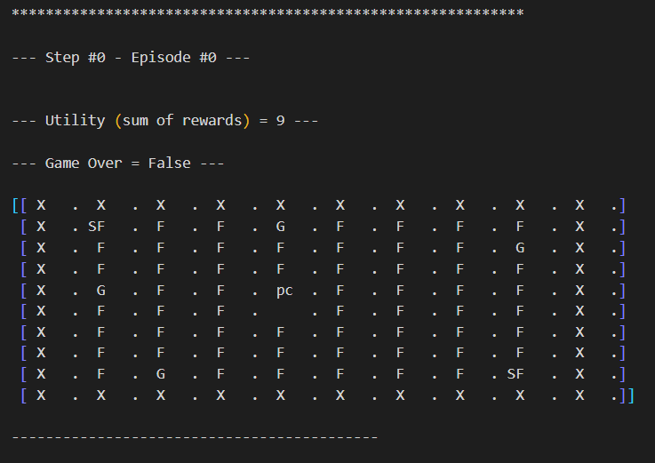

# Pacman Game

## Goal

1. Build customized pacman game using native python libraries, and openai gym, [my_pacman.py](envs/my_pacman.py)
2. Develop a random agent, implemented [pacman_game.py](envs/pacman_game.py)
3. Develop another agent that uses `Value Iteration` to achieve max utility, implemented here [pacman_game_q.py](envs/pacman_game.py)

---

- Note: No graphical rendering was used. However, for visualizing how it will be rendered check the 

---

## Starters

- [For installation and getting started](docs/installation.md)

- [Intro to Markov Decision Process](docs/Markov_Decision_Process.md)

- [Intro to Reinforcement learning](docs/RL_Intro.md)

- [Intro to Q Learning](docs/Q_Learning.md)

- [Methods from Openai gym api](docs/about_openai_gym_methods.md)

---

## All about My Pacman

Initialize the game

- Creating a 10X10 grid environment,
- Pacman starting position in the middle (approximately) {5, 4}.
- Environment made up of
  - Agent (pacman)
  - fixed walls,
  - fixed 4 ghosts are placed,
  - 2 special food pieces (power ups) lasts for 10 steps,
  - 66 food pieces, why? ((10 x 10) - 34) grid size subtract all other elements from it,
  - starting reward of 0,
  - utility functions of 0.

---

Agent Actions & Rewards

- Actions (Discrete 4):

  - Up(0) Agent will go up if possible, by adding 1 to rows
  - Down(1) Agent will go down if possible, by removing 1 from rows
  - Right(2) Agent will go right if possible, by adding 1 to cols
  - Left(3) Agent will go left if possible, by removing 1 from cols

- Action consequences

  - trying to go outside of the grid, by bumping into a wall
  - eating food (Regular food or special food)
  - nothing
  - Ghosts (PC not powered up, or, PC is powered up)

- Rewards (6):

  - reward = -1000 -> Pacman is killed by a ghost,
  - reward = 0 -> Pacman is alive,
  - reward = 10 -> Pacman eats a food piece,
  - reward = 50 -> Pacman eats a special
  - reward = 100 -> Pacman eats a ghost
  - reward = 1000 -> Pacman finished all food pieces.

---

Game Rendering

- Map Values:

  - 0 food piece to eat
  - 1 ghosts
  - 2 walls
  - 3 eaten food piece
  - 9 Pacman
  - 11 special food piece

- Representation of the values
  - Food pieces to eat "F"
  - Special food "SF"
  - Ghosts "G"
  - Walls "X"
  - Eaten food pieces " "
  - Powered Up pacman "PC"
  - Normal pacman "pc"

---
